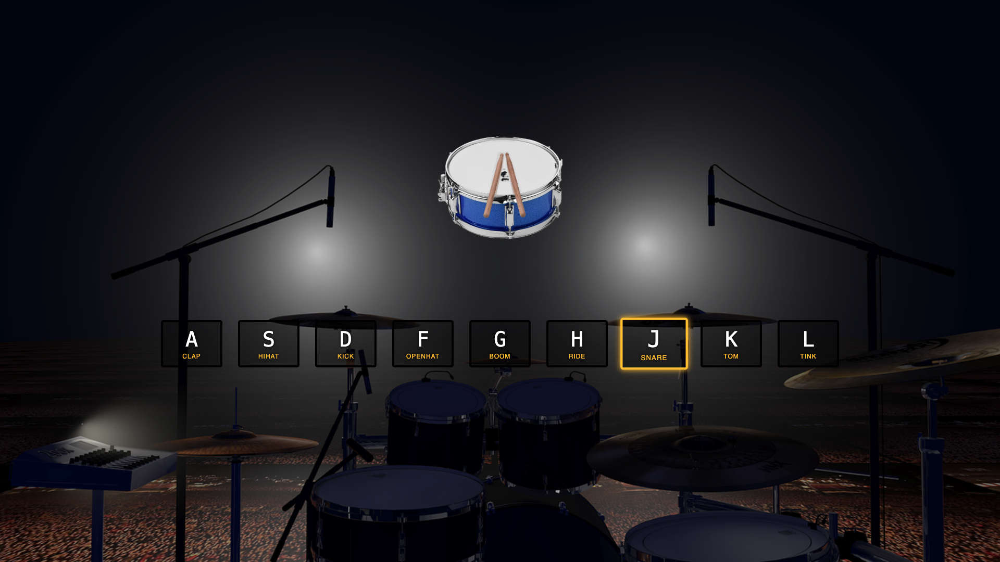

# **🥁 Drum Kit**

This project is a simple drum machine.
When you press specific keys on your keyboard, a drum sound is played and the corresponding button is visually highlighted.

## 🎹 Used Keys
The following keys trigger drum sounds:
A, S, D, F, G, H, J, K, L

To find the corresponding data-key values, I used keycode.info.

## 🖼️ Preview
Here’s what the drum kit looks like in action:

## 🛠️ Technologies
* HTML5

* CSS3

* Vanilla JavaScript (ES6)

## 🚀 How to Use
Clone the repository

Open index.html in your browser

Start playing using your keyboard 🎧
